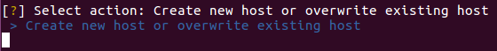

- [Requirements](#requirements)
  * [Local Machine / Control Machine](#local-machine---control-machine)
  * [Remote Machine / Managed Node](#remote-machine---managed-node)
- [Quickstart Videos](#quickstart-videos)
- [Installation on Control Machines](#installation-on-control-machines)
  * [Ubuntu 16.04](#ubuntu-1604)
  * [Windows](#windows)
    + [Installation using WSL](#installation-using-wsl)
    + [Installation using Cygwin](#installation-using-cygwin)
  * [Running Using Docker](#running-using-docker)
- [Managed Nodes Setup](#managed-nodes-setup)
  * [Linux](#linux)
  * [Windows](#windows-1)
    + [Microsoft Windows Prerequisites for Ansible](#microsoft-windows-prerequisites-for-ansible)
- [Usage](#usage)
  * [Creating Scripts for Managed Nodes](#creating-scripts-for-managed-nodes)
  * [Running the Provisioning Scripts](#running-the-provisioning-scripts)
- [Preconfigured Tool Sets](#preconfigured-tool-sets)
- [Installation Times](#installation-times)
- [Advanced Topics](#advanced-topics)
  * [Creating Prepared Scripts](#creating-prepared-scripts)
  * [Managing Configuration Files](#managing-configuration-files)
  * [What if...](#what-if)
    + [... I am using another linux distribution?](#-i-am-using-another-linux-distribution-)
    + [... some package is broken on the repository?](#-some-package-is-broken-on-the-repository-)
    + [... I need a tool that is not being installed?](#-i-need-a-tool-that-is-not-being-installed-)
    + [... there is a tool in pre / post tasks hat I don't need/want to be installed?](#-there-is-a-tool-in-pre---post-tasks-hat-i-don-t-need-want-to-be-installed-)
    + [... I don't like ansible and prefer \[write here any other scripting language\]](#-i-don-t-like-ansible-and-prefer---write-here-any-other-scripting-language--)

<small><i><a href='http://ecotrust-canada.github.io/markdown-toc/'>Table of contents generated with markdown-toc</a></i></small>


# Requirements

If you will run `ansible-scripts` from docker, the only requirement is docker. See [here](#run-using-docker).

## Local Machine / Control Machine

1. Ansible (Version 2.4+);
1. SSH client
1. Git

## Remote Machine / Managed Node

1. SSH (linux)
1. Python 2 (version 2.6 or later) or Python 3 (version 3.5 or later)

For windows managed nodes, please check [here](#windows-setup).


# Quickstart Videos

1. How to setup a Ubuntu Control Machine: [Link](#done)
1. How to setup a Windows Control Machine:
1. How to run the tool on a Ubuntu Managed Node: [Link](#done)
1. How to run the tool on a Windows Managed Node  [Link](#done)
1. How to run from docker: [link](https://drive.google.com/open?id=1ELdMpqVwhbl_osVwRoyJMmzLhrxvkzrh)
1. How to create a new distro [Link](#done)
1. How to create a new dev environment
1. How to create a new prepared task
1. How to install a local file to a managed node


# Installation on Control Machines

We provide guides to use `ansible-scripts` on Ubuntu 16.04 and Windows. If you do not want to do the installation but still want to use `ansible-scripts` you can skip to [Run Using Docker](#run-using-docker).

## Ubuntu 16.04

Run the following commands to install `ansible-scripts` on your home folder.

```
$ sudo apt update
$ sudo apt install software-properties-common openssh-client git python-pip
$ sudo apt-add-repository ppa:ansible/ansible
$ sudo apt update
$ sudo apt install ansible
$ cd ~
$ git clone https://github.com/alair-aurea/ansible-scripts.git
$ cd ansible-scripts
$ pip install -r requirements.txt
```

## Windows

Windows isn't supported for the control machine. However, there are some workarounds to run `ansible-scripts` if you are on a windows machine. You can use:

<!-- 1. [Cygwin](https://cygwin.com)( Recommended ) -->
1. Windows Subsystem for Linux (WSL) **\[Recomended\]** ( Windows 10 only )
1. VirtualBox or VMWare to virtualize a machine running linux
1. [Docker for Windows](https://docs.docker.com/docker-for-windows/install/) ( Windows 10 only )

### Installation using WSL

1. Go to [https://docs.microsoft.com/en-us/windows/wsl/install-win10](https://docs.microsoft.com/en-us/windows/wsl/install-win10) and follow the instructions to install and run a linux distribution inside Windows. We recommend Ubuntu 16.04. 

1. Run the commands for Ubuntu 16.04.

<!--
### Installation using Cygwin

To install Cygwin and `ansible-scripts`, follow these steps:

1. Download Cygwin from [http://cygwin.com/setup-x86_64.exe](http://cygwin.com/setup-x86_64.exe); 
1. To install Cygwin and all Ansible dependences, run the following command:
   ```
   setup-x86_64.exe -q --packages=binutils,curl,cygwin32-gcc-g++,gcc-g++,git,gmp,libffi-devel,libgmp-devel,make,nano,openssh,openssl-devel,python-crypto,python-paramiko,python2,python2-devel,python2-openssl,python2-pip,python2-setuptools
    ```
1. Open Cygwin prompt and check which `pip` commando you should use:
    * Run `which pip` and `which pip2`. Do not use the command that gives you something like `cygdrive/c/...`.
1. From Cygwin bash run `pip install -vvv ansible` or `pip2 install -vvv ansible`, depending on the results of the previous command.
    * This command may take a long time. So, be patient.
1. Run:
    ```
    $ git clone https://github.com/alair-aurea/ansible-scripts.git
    $ cd ansible-scripts
    $ pip2 install -r requirements.txt
    ```
-->

<!--## Mac

T.B.D.
-->
## Running Using Docker

A docker image is available to run `ansible-scripts`. If you have docker installed, you just need to create the following tree structure in your home folder:

```
.
├── ansible-data
│   ├── inventories
│   ├── keys
│   └── playbooks
```
Then, just run:

```
docker run -it --rm -v ~/ansible-data/keys:/home/ansible/ansible-scripts/keys -v ~/ansible-data/inventories:/home/ansible/ansible-scripts/inventories -v ~/ansible-data/playbooks:/home/ansible/ansible-scripts/playbooks alairjunior/ansiblescripts
```
Your data will be available in `~/ansible-data` even if you delete the docker container. Check this [video](https://drive.google.com/open?id=1ELdMpqVwhbl_osVwRoyJMmzLhrxvkzrh) to see how it works.

# Managed Nodes Setup

## Linux

To control a Linux node, the only requirements are:

1. Python 2 (version 2.6 or later) or Python 3 (version 3.5 or later)
1. A running ssh server

## Windows

In order to a Control Machine to use Ansible for controlling a Windows Managed Node, it is necessary to follow some procedures. Mostly of the Windows related are marked as "not stable interface" on Ansible, which means that Windows host monitoring may break due to updates. 

### Microsoft Windows Prerequisites for Ansible

1. PowerShell 3.0 or newer
1. At least .NET 4.0

    * You can find detailed original post in below link.
      `https://docs.ansible.com/ansible/2.5/user_guide/windows_setup.html`
    * To check your powershell version; `$PSVersionTAble.PSVersion`

1. WinRM listener should be created and activated.

Connect to the VDI Instance and open a PowerShell. Then, execute the following commands:

```
$url = "https://raw.githubusercontent.com/ansible/ansible/devel/examples/scripts/ConfigureRemotingForAnsible.ps1"
$file = "$env:temp\ConfigureRemotingForAnsible.ps1"

(New-Object -TypeName System.Net.WebClient).DownloadFile($url, $file)

powershell.exe -ExecutionPolicy ByPass -File $file
```

After this step ansible can connect to windows machine with `ntlm` configuration. 

# Usage

The tool have a user interface that guides the user through the configuration process. To run it, just go to the repository root directory and run the python script `run.py`.

## Creating Scripts for Managed Nodes

After running `ansible-scripts` for the first time you should see the following menu:



To create a new host, just follow the prompts. Check [this video](https://drive.google.com/open?id=1aLZP0MF4ZIiYITmFetV3bA7i_F2oJCU1) to see an example.

## Running the Provisioning Scripts

When a managed node (host) is available, you may run the script from the initial menu. [This video](https://drive.google.com/open?id=1SBDjO8uC4Re0uoLKki-lBdtC_Nsp6mqJ) shows how to do it.

Example of inventory files can be seen below.


# Preconfigured Tool Sets

|            TOOL NAME            | Windows Support | Ubuntu Support | Amazon Support |
|:-------------------------------:|:---------------:|:--------------:|:--------------:|
| Oracle JDK 8                    |        +        |        +       |        +       |
| Maven                           |        +        |        +       |        +       |
| Docker & Docker Compose         |        +        |        +       |        +       |
| MySql Server                    |        +        |        +       |        +       |
| Nodejs                          |        +        |        +       |        +       |
| Npm                             |        +        |        +       |        +       |
| Cygwin                          |        +        |        X       |        X       |
| Notepad++                       |        +        |        X       |        X       |
| Eclipse                         |        +        |        X       |        X       |
| Visual Studio 2015              |        +        |        X       |        X       |
| Visual Studio 2017              |        +        |        X       |        X       |
| JetBrains dotTrace              |        +        |        X       |        X       |
| Telerik Fiddler                 |        +        |        X       |        X       |
| VS Code                         |        +        |        X       |        X       |
| MS SQL Server management Studio |        +        |        X       |        X       |
| Total Commander                 |        +        |        X       |        X       |
| Sysinternals suite              |        +        |        X       |        X       |
| Gradle                          |        +        |        +       |        +       |
| YourKit Java profiler           |        +        |        +       |        +       |
| GIT                             |        +        |        +       |        +       |
| Revert Tool                     |        +        |        +       |        +       |
| Chrome                          |        +        |        +       |        -       |
| IntelliJ IDEA                   |        +        |        -       |        -       |
| Redis                           |        +        |        +       |        -       |
| Firefox Mozilla                 |        +        |        +       |        -       |
| MySQL Workbench                 |        -        |        +       |        -       |
| Oracle SQL Developer            |        -        |        -       |        -       |
| Plan Explorer                   |        -        |        X       |        X       |

+ 'X'	means "no need"
+ '-'	means "installation not preconfigured yet"
+ '+'	means "installation preconfigured"

# Installation Times

| Operating System | Technology Category | All Tools in Category Installation Time |
|:----------------:|:-------------------:|:---------------------------------------:|
|      Windows     |         Java        |               14mins 3secs              |
|      Windows     |         .Net        |               28mins 2secs              |
|      Windows     |         C++         |              38mins 33secs              |
|   Ubuntu Linux   |         Java        |               7mins 13secs              |
|   Ubuntu Linux   |         C++         |               6mins 40secs              |
|   Amazon Linux   |         Java        |               5mins 34secs              |
|   Amazon Linux   |         C++         |               5mins 11secs              |

# Advanced Topics
<!--
## Creating Prepared Scripts

## Managing Configuration Files
-->
## What if...

### ... I am using another linux distribution?

You can create the configuration for the distribution you are working. There is one limitation: for the package selection menu to work properly, the distribution should be supported by [Ansible's package module](https://docs.ansible.com/ansible/2.5/modules/package_module.html). 

Follow this steps:

1. Go to `configs` directory and add the name of your distribution to `linux.conf` under section `[distros]`;
2. Create a section for your distro specific variables, like `[your-distro:ansible:variables]`. These variables are going to be copied to the Ansible's inventory file. Check how these variables work in [Ansible's Variables Document](https://docs.ansible.com/ansible/latest/user_guide/playbooks_variables.html).
3. Create a section for each one of the supported dev environments, like `[your-distro:Java:package]` or `[your-distro:C++:package]`. Add the packages that should be available in the menu.
4. Create prepared task files to perform preparation tasks and post installation tasks.

### ... some package is broken on the repository?

You don't need to change the `configs` to manage this situation. You can just disable the package using the menu and select the option to install additional packages, writing the correct name of the package there. However, if you want a more definitive solution, you may change the package name on the corresponding os config file.

### ... I need a tool that is not being installed?

If the tool is available in the repositories (chocolatey for windows or distro specific repository for linux), you may just chose to install additional packages and write the package name when asked. This will create a proper script for installing the package. If you want this package to be available on the package selection menu, you have to include the package in section `distro:dev-env:packages`, where `dev-env` is the type of your development environment (Java, .NET, ...). You can make the package marked to be installed as default by writing `=yes` following the package name. Otherwise, write `=no`.

If the package is not available in the repositories, you'll have to write a task for installing it. Write a prepared task and select the created file when prompted during Host Configuration Creation. Please, refer to the [Ansible's manual](https://docs.ansible.com/ansible/latest/user_guide/playbooks.html) to understand how to create tasks.

### ... there is a tool in pre / post tasks hat I don't need/want to be installed?

Just go to `prepared-tasks` directory and open the prepared playbook containing the tasks that installs the tools you want to remove. You can eiter delete the corresponding lines or better, you can copy the file and create a new one without the tool you don't want. 

### ... I don't like ansible and prefer \[write here any other scripting language\]

You can use `ansible-scripts` to copy your script file written on your prefered language to the monitored node, using Ansible's [copy module](https://docs.ansible.com/ansible/2.5/modules/copy_module.html) and [command module](https://docs.ansible.com/ansible/2.5/modules/command_module.html).

